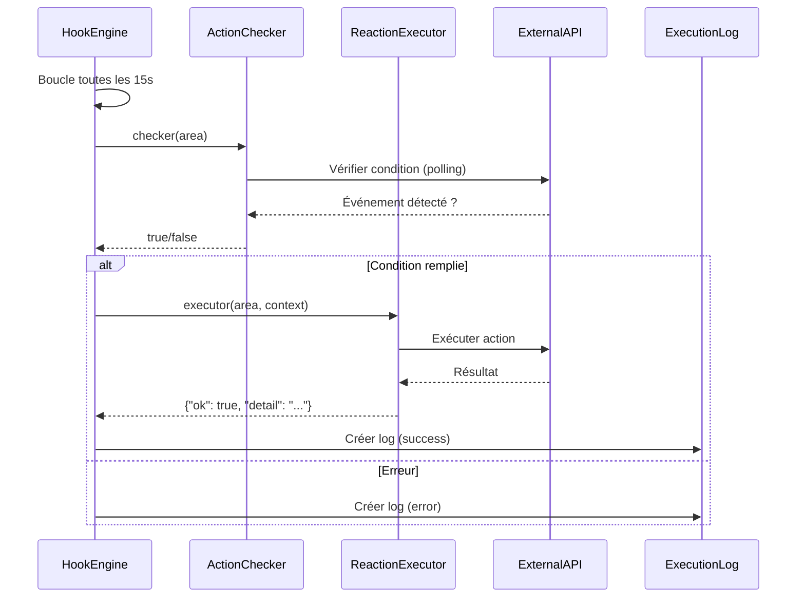

# Rapport d'Analyse - Projet ACTION-REACTION (AREA)

## 1. Vue d'Ensemble du Projet

### 1.1 Description
Le projet ACTION-REACTION est une plateforme d'automatisation similaire à IFTTT/Zapier, permettant d'interconnecter différents services externes (GitHub, Gmail, Discord, Spotify, etc.) via des AREAs (Actions + Réactions).

### 1.2 Architecture Générale

Le projet est composé de trois composants principaux :

1. **Serveur d'Application (Backend)** : Django/DRF exposant une API REST sur le port 8080
2. **Client Web** : Application Next.js exposée sur le port 8081
3. **Client Mobile** : Application React Native (APK Android disponible via le web)

L'architecture respecte le principe : **aucune logique métier côté client** - tout est géré par le serveur via l'API REST.

### 1.3 Orchestration Docker

Le projet utilise Docker Compose avec les services suivants :
- `server` : Backend Django (port 8080)
- `client_web` : Frontend Next.js (port 8081)
- `client_mobile` : Build APK Android (volume partagé)
- `hook_engine` : Moteur d'exécution des AREAs (background)
- `db` : PostgreSQL (port 5433)
- `adminer` : Interface de gestion de la base (port 8082)

Le client web et mobile partagent un volume (`apk_volume`) pour que l'APK générée soit accessible via `http://localhost:8081/client.apk`.

## 2. État d'Avancement du Projet

### 2.1 Fonctionnalités Implémentées ✅

#### Authentification & Gestion Utilisateurs
- ✅ Inscription utilisateur (`POST /auth/register/`)
- ✅ Connexion avec JWT (access + refresh tokens) (`POST /auth/login/`)
- ✅ Gestion de profil (`GET /auth/me/`)
- ✅ Rafraîchissement de token (`POST /auth/refresh/`)
- ✅ Réinitialisation de mot de passe (demande + confirmation)
- ✅ OAuth2 : Lien de comptes tiers (Google, GitHub, Facebook, Twitter)
- ✅ Gestion des sessions utilisateur avec refresh tokens

#### Services & Abonnements
- ✅ Liste des services disponibles (`GET /services/`)
- ✅ Détails d'un service (`GET /services/<id>/`)
- ✅ Abonnement à un service (`POST /services/<id>/subscribe/`)
- ✅ Désabonnement (`DELETE /services/<id>/unsubscribe/`)
- ✅ Liste des services auxquels l'utilisateur est abonné (`GET /services/subscriptions/`)
- ✅ Chiffrement des tokens OAuth (Fernet) dans `UserService`
- ✅ Système de Providers avec registre (`ProviderRegistry`)

#### AREAs (Automatisations)
- ✅ Création d'AREA (`POST /areas/`)
- ✅ Liste des AREAs utilisateur (`GET /areas/`)
- ✅ Détails d'une AREA (`GET /areas/<id>/`)
- ✅ Mise à jour d'AREA (`PATCH /areas/<id>/`)
- ✅ Suppression d'AREA (`DELETE /areas/<id>/`)
- ✅ Journalisation des exécutions (`ExecutionLog`)
- ✅ Statistiques du dashboard (`GET /stats/`)

#### Moteur de Hooks (Hook Engine)
- ✅ Commande `run_hooks` pour exécuter les AREAs
- ✅ Système de registres pour actions et réactions
- ✅ Décorateurs `@register_action` et `@register_reaction`
- ✅ Exécution en boucle avec intervalle configurable (15s par défaut)
- ✅ Mode oneshot pour test

#### Endpoint about.json
- ✅ Implémentation conforme au format requis
- ✅ Retourne : `client.host`, `server.current_time`, `server.services[]`
- ✅ Intègre les paramètres des actions/réactions depuis les providers

#### OAuth pour Services Spécifiques
- ✅ GitHub : URLs d'authentification et callback
- ✅ Spotify : URLs d'authentification et callback
- ✅ Google : Échange de code OAuth
- ✅ Endpoints pour récupérer ressources (répertoires GitHub, playlists Spotify)

### 2.2 Services Décrits (Providers)

Les providers suivants sont définis dans `server/automation/providers/` :

1. **System** (`system.py`)
   - Actions : `timer`
   - Réactions : `log`

2. **Timer** (`timer.py`) - Service séparé du System
   - Actions : `every_minute`, `every_hour`, `every_day`, `cron_schedule`
   - Réactions : aucune

3. **Gmail** (`google.py` - nommé `gmail`)
   - Actions : `gmail_new_email`
   - Réactions : `gmail_send_email`

4. **GitHub** (`github.py`)
   - Actions : `new_commit`, `new_issue`, `new_pull_request`
   - Réactions : `create_issue`

5. **Discord** (`discord.py`)
   - Actions : `new_message`
   - Réactions : `send_message`

6. **Spotify** (`spotify.py`)
   - Actions : `new_saved_track`
   - Réactions : `add_to_playlist`

7. **Telegram** (`telegram.py`)
   - Actions : `new_message`
   - Réactions : `send_message`

8. **Twitter** (`twitter.py`)
   - Actions : `new_tweet`
   - Réactions : `post_tweet`

9. **WeatherAPI** (`weatherapi.py`) - commenté dans `__init__.py`
   - Actions : `temperature_change`
   - Réactions : aucune

### 2.3 Handlers Implémentés (Actions & Réactions)

#### Actions Implémentées
- ✅ `timer` (`hooks/actions/timer.py`) - Fonctionnel
- ⚠️ `github_new_issue` (`hooks/actions/github_new_issue.py`) - Simulateur uniquement (`cfg.get("simulate", False)`)
- ⚠️ `github_new_commit` - Fichier existe
- ⚠️ `github_new_pull_request` - Fichier existe
- ⚠️ `gmail_new_email` - Fichier existe
- ⚠️ `discord_new_message` - Fichier existe
- ⚠️ `spotify_new_saved_track` - Fichier existe
- ⚠️ `telegram_new_message` - Fichier existe
- ⚠️ `twitter_new_tweet` - Fichier existe
- ⚠️ `weatherapi_temperature_change` - Fichier existe

#### Réactions Implémentées
- ✅ `log` (`hooks/reactions/log.py`) - Fonctionnel
- ✅ `github_create_issue` (`hooks/reactions/github_create_issue.py`) - Fonctionnel (appel API GitHub)
- ⚠️ `gmail_send_email` - Fichier existe
- ⚠️ `discord_send_message` - Fichier existe
- ⚠️ `spotify_add_to_playlist` - Fichier existe
- ⚠️ `telegram_send_message` - Fichier existe
- ⚠️ `twitter_post_tweet` - Fichier existe

**Note** : Beaucoup de handlers existent mais leur implémentation complète n'a pas été vérifiée dans ce rapport. Le fichier `IMPLEMENTATION_PLAN.md` indique que seul le couple `system.timer` / `system.log` est pleinement fonctionnel.

### 2.4 Base de Données

#### Modèles Principaux
- ✅ `Service` : Services disponibles (GitHub, Gmail, etc.)
- ✅ `Action` : Actions offertes par un service
- ✅ `Reaction` : Réactions offertes par un service
- ✅ `UserService` : Abonnements utilisateur avec tokens chiffrés
- ✅ `Area` : Liaison Action → Réaction avec configurations JSON
- ✅ `ExecutionLog` : Journal des exécutions (succès/erreur)
- ✅ `Session` : Gestion des sessions utilisateur
- ✅ `OAuthAccount` : Comptes OAuth liés (séparé de UserService)

### 2.5 Clients (Web & Mobile)

#### Client Web (Next.js)
- ✅ Pages d'authentification (login, register, forgot-password, reset-password)
- ✅ Dashboard utilisateur
- ✅ Gestion des services (liste, abonnements)
- ✅ Création et gestion d'AREAs
- ✅ Affichage des logs d'exécution
- ✅ Page de settings
- ✅ Navigation et layout

#### Client Mobile (React Native)
- ✅ Structure React Native configurée
- ✅ Build Android (APK)
- ✅ Écrans similaires au web (Dashboard, Services, Areas, etc.)
- ✅ Configuration serveur via `SERVER_CONFIG.md`

### 2.6 Documentation

- ✅ `README.md` : Documentation principale
- ✅ `API_ENDPOINTS.md` : Liste des endpoints API
- ✅ `COMMANDS.md` : Commandes Docker et tests
- ✅ `HOWTOCONTRIBUTE.md` : Guide pour ajouter services/actions/réactions
- ✅ `SERVICES_README.md` : Référence rapide des services
- ✅ `CICD.md` : Documentation CI/CD
- ✅ `IMPLEMENTATION_PLAN.md` : Plan d'implémentation (état obsolète)

## 3. Points d'Attention et Problèmes Identifiés

### 3.1 Erreur de Syntaxe 🐛

**Fichier** : `server/automation/providers/github.py`  
**Ligne** : 34  
**Problème** : Erreur de syntaxe dans la définition des paramètres
```python
'params': [{git'name': 'repository', 'type': 'string'}]  # ❌ ERREUR
```
**Correction nécessaire** :
```python
'params': [{'name': 'repository', 'type': 'string'}]  # ✅ CORRECT
```

### 3.2 Handlers Partiellement Implémentés ⚠️

- La plupart des handlers d'actions semblent être des stubs (ex: `github_new_issue` retourne simplement `cfg.get("simulate", False)`)
- Les handlers doivent faire des appels API réels pour vérifier les conditions
- Nécessité d'implémenter la logique de polling/webhooks pour chaque service

### 3.3 Provider Timer vs System ⚠️

- Il existe deux providers différents : `SystemProvider` (action `timer`) et `TimerProvider` (actions `every_minute`, etc.)
- Cette duplication pourrait créer de la confusion
- Le handler `timer.py` utilise le type `"timer"` qui correspond à `SystemProvider`, pas `TimerProvider`

### 3.4 WeatherAPI Commenté ⚠️

- Le provider `weatherapi` est importé mais commenté dans `providers/__init__.py`
- Cela peut causer des problèmes si des services WeatherAPI sont enregistrés en base

### 3.5 Gestion des Erreurs dans les Handlers

- Certains handlers peuvent lever des exceptions non gérées
- Le hook engine capture les exceptions mais pourrait bénéficier d'une meilleure gestion d'erreur

## 4. Architecture Technique Détailée

### 4.1 Flux d'Exécution d'une AREA



### 4.2 Système de Registres

- **ProviderRegistry** : Enregistre les providers (décorateur `@ProviderRegistry.register`)
- **action_checkers** : Dictionnaire `{action_name: function}` pour les vérifications
- **reaction_executors** : Dictionnaire `{reaction_name: function}` pour les exécutions

Les handlers sont chargés dans `run_hooks.py` via des imports forcés.

### 4.3 Sécurité

- ✅ Tokens OAuth chiffrés avec Fernet (dérivé de `SECRET_KEY`)
- ✅ JWT pour l'authentification (access + refresh tokens)
- ✅ Refresh tokens hashés (SHA256) dans `Session`
- ✅ Throttling DRF configuré (100/min anonyme, 300/min authentifié)
- ✅ CORS configuré pour les clients web/mobile

### 4.4 Structure des Données AREA

```python
Area {
    user: User
    action: Action (ex: "new_issue")
    reaction: Reaction (ex: "create_issue")
    config_action: {
        "type": "new_issue",  # Utilisé pour dispatcher le handler
        "repository": "user/repo",
        # ... autres paramètres spécifiques
    }
    config_reaction: {
        "type": "create_issue",
        "repository": "user/repo",
        # ... autres paramètres
    }
    enabled: bool
}
```

## 5. Recommandations

### 5.1 Priorités Immédiates

1. **Corriger l'erreur de syntaxe** dans `github.py` (ligne 34)
2. **Implémenter les handlers réels** pour les actions (actuellement beaucoup sont des stubs)
3. **Clarifier la distinction** entre `SystemProvider` et `TimerProvider`
4. **Activer ou supprimer** le provider WeatherAPI selon les besoins

### 5.2 Améliorations Techniques

1. **Polling vs Webhooks** : Décider quelle stratégie utiliser pour chaque service
   - Polling : Plus simple mais moins efficace
   - Webhooks : Plus efficace mais nécessite endpoints publics

2. **Gestion des tokens expirés** : Implémenter le refresh automatique des tokens OAuth

3. **Tests** : Augmenter la couverture de tests pour les handlers

4. **Monitoring** : Ajouter des métriques pour le hook engine (taux de succès, latence, etc.)

5. **Cache** : Considérer un cache pour éviter les appels API répétés

### 5.3 Documentation

- Mettre à jour `IMPLEMENTATION_PLAN.md` avec l'état réel d'avancement
- Documenter chaque handler avec des exemples de configuration
- Ajouter des diagrammes d'architecture plus détaillés

## 6. Conformité au Sujet

### 6.1 Exigences Respectées ✅

- ✅ Architecture 3 composants (server, web, mobile)
- ✅ Docker Compose avec services requis
- ✅ Endpoint `/about.json` conforme
- ✅ Volume partagé pour APK
- ✅ Gestion utilisateurs complète
- ✅ Authentification JWT + OAuth2
- ✅ Abonnement aux services
- ✅ Création et gestion d'AREAs
- ✅ Moteur de hooks
- ✅ Documentation complète (README, HOWTOCONTRIBUTE, etc.)

### 6.2 Exigences Partiellement Respectées ⚠️

- ⚠️ **Handlers fonctionnels** : Beaucoup d'actions/réactions sont des stubs
- ⚠️ **Nombre de services** : Nécessite vérification selon le nombre d'étudiants dans le groupe
- ⚠️ **Tests d'intégration** : Présence de tests mais couverture non vérifiée

### 6.3 Exigences Non Vérifiées ❓

- ❓ Accessibilité (WCAG) côté clients
- ❓ Administration des utilisateurs
- ❓ Déploiement en production
- ❓ Validation finale avec docker-compose up

## 7. Conclusion

Le projet ACTION-REACTION présente une architecture solide et bien structurée avec la plupart des composants de base en place. L'authentification, la gestion des utilisateurs, les AREAs et le moteur de hooks sont fonctionnels. Cependant, de nombreux handlers d'actions et réactions nécessitent une implémentation complète pour être pleinement opérationnels. Le projet est bien documenté et suit les bonnes pratiques de développement.

**État global** : ~70% fonctionnel (architecture complète, handlers partiels)

---

*Rapport généré le : [Date actuelle]*  
*Fichiers analysés : Structure complète du projet*

